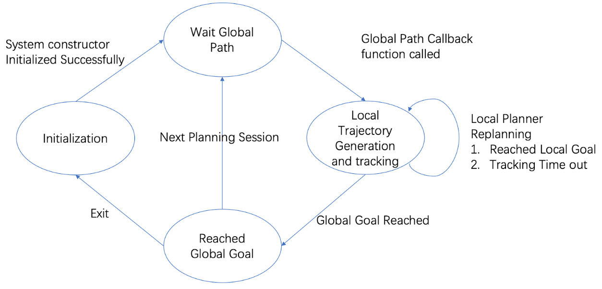

# RACE CAR TRAJECTORY GENERATIONAND TRACKING WITH FEEDBACKLINEARIZATION

## Introduction
Local trajectory generation and tracking is one of the fundamental problems in robot navigation. A typical navigation task with given map can be divided to global planning, local planning and control. First, using given map with obstacles, global planner can generate a global path with obstacle avoidance, then local planner will generate local smooth trajectories along the global path and control robot to track smooth trajectories.

In this project, we focus on designing local planner for race car robot that dynamically generate local smooth trajectories along the global path with replanning functionality, and use feedback linearization method to control robot tracking the dynamically generated trajectory. We implemented our local planner in C++ and tested in Gazebo simulation environment. 
## Theory
### Dynamic model of the robot car

where the controls are acceleration and steering angle.
### Differential flatness
Consider the problem of generating a trajectory between two given states

The boundary conditions of a differentially flat systems are expressed as

## Control law
The feedback linearization method is applied to design a control law for
generated trajectory $(x(t), y(t))$ let us set the states to be the
form below:

Tracking with feedback is much more desirable in order to have
robustness.Assume that we can measure the position (x1, x2) and we would
like to track it. We specify that by the output

We differentiate the output $y$ till obtain the controls

## System design
Our project used a finite-state machine(FSM) to control the local
planner in navigation. The local planner FSM has 4 states: Initializing,
Waiting for Global Path, Running and Reached Global Goal. States
transition in FSM is shown in Fig [FSM].

 [FSM]

​1. Initializing: Local planner initialization, connect all ROS
subscribers and publishers, initialize variables. Once initialization
finished, switch state to Waiting for Global Path state.

​2. Wait for Global Path: Local Planner initialized, waiting for global
path message, once the global path topic callback function is called and
received valid global path, switch to Running state.

​3. Running: For the received global path, dynamically look ahead and
generate trajectory while tracking the trajectory using feedback
linearization in the same time. Once Reached Global in given threshold,
switch to Reached state.

​4. Reached: Reached global goal, either exit and switch initialization
state, or start a new navigation session and switch to Wait for Global
Path state.
